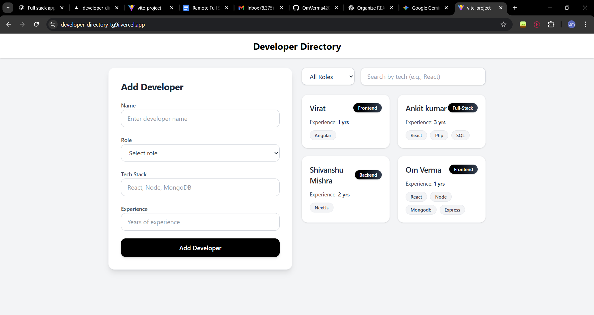

# Developer Directory: Full-Stack MERN Application


A clean and efficient full-stack developer management platform built with the MERN stack (MongoDB, Express.js, React, Node.js), allowing users to add developers, filter by role, and search by tech stack through a responsive modern UI.

---

## 📍 Live Demo

| Live Application |
|------------------|
| [**🔗 View Live Demo**] (https://developer-directory-tg9i.vercel.app/)|

---

## 📸 Application Preview

### Add Developer Form


---

## ✨ Key Features

* **Add Developer Profiles:** Add name, role, tech stack, and experience.
* **Search & Filter:** Search by tech stack & filter by role.
* **Responsive UI:** Tailwind-based modern design.
* **REST API:** Backend built with Express.js and MongoDB.
* **Clean Architecture:** Controllers, routes, models, utilities.
* **Smooth Frontend:** React + Vite with clean reusable components.

---

## 🛠️ Tech Stack

| Category | Technologies |
|----------|-------------|
| **Frontend** | React, Vite, Tailwind CSS, Axios, React Hot Toast |
| **Backend** | Node.js, Express.js, MongoDB, Mongoose |
| **Utilities** | ApiResponse, ApiError, asyncHandler |
| **Deployment** | Vercel (Frontend), Render (Backend) |

---

## ⚙️ Getting Started

Follow these steps to set up the project locally.

### Prerequisites

* Node.js (v18 or later)
* MongoDB Atlas or local MongoDB
* Git installed

### 1. Clone the Repository

```bash
git clone https://github.com/OmVerma420/developer-directory.git
cd developer-directory
```

### 2. Backend Setup

```bash
# Navigate to the server directory
cd server

# Install dependencies
npm install

# Create a .env file and add the required environment variables (see .env.example)
touch .env

# Start the backend server
npm start
```

### 3. Frontend Setup

```bash
# Navigate to the client directory from the root
cd frontend

# Install dependencies
npm install

# Create a .env file and add the required environment variables (see .env.example)
touch .env

# Start the frontend development server
npm run dev
```

## 🤝 Contributing

Contributions, issues, and feature requests are welcome! Feel free to check the issues page.

1. Fork the project.
2. Create your Feature Branch (`git checkout -b feature/AmazingFeature`).
3. Commit your changes (`git commit -m 'Add some AmazingFeature'`).
4. Push to the branch (`git push origin feature/AmazingFeature`).
5. Open a Pull Request.


## 📄 License

This project is licensed under the ISC License. See the LICENSE file for more details.

## 👨‍💻 Connect with Me

Let's connect! You can find me on:

- GitHub: [OmVerma420](https://github.com/OmVerma420)
- LinkedIn: [Om Verma](https://www.linkedin.com/in/om-verma-562b13258)

---

*Made with using MERN Stack*
=======
