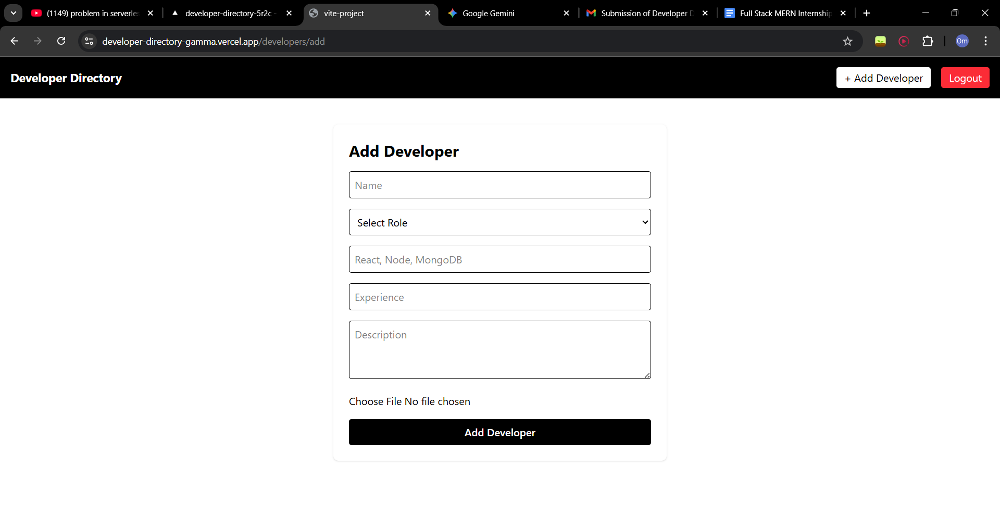
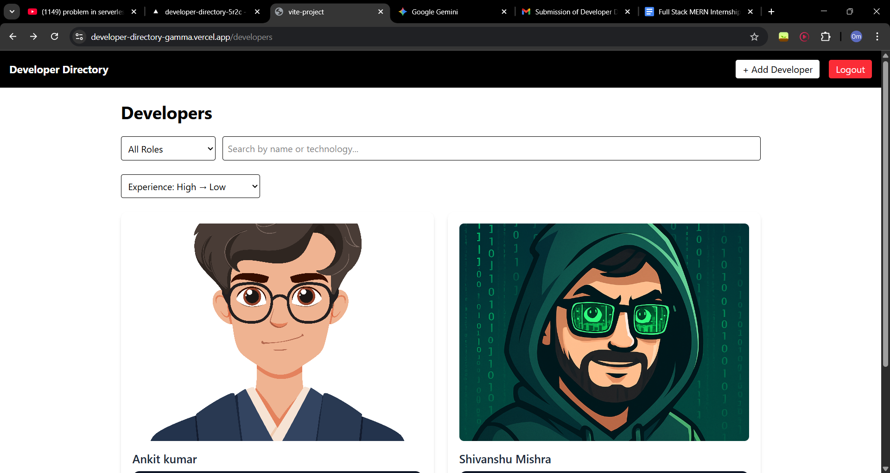
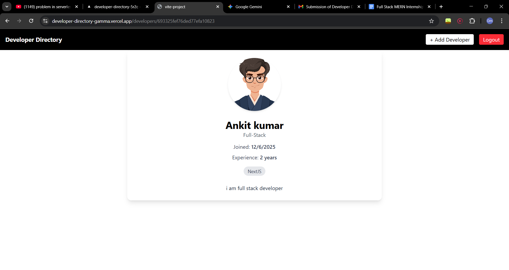
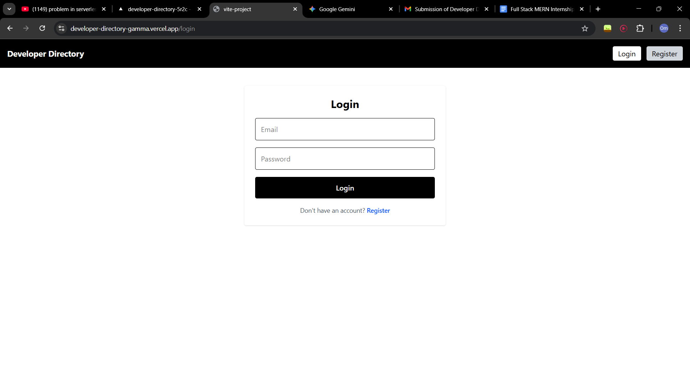
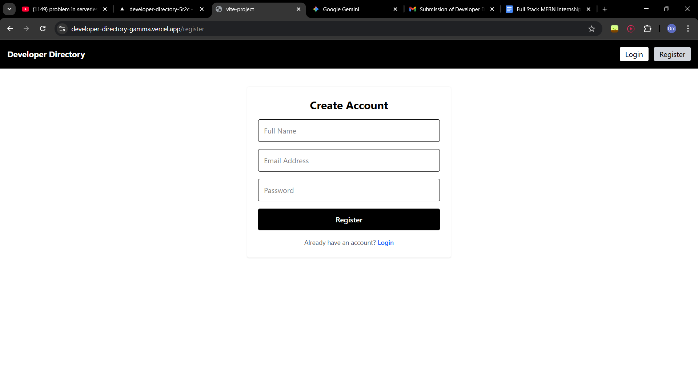

# 👨‍💻 Developer Directory — Full-Stack MERN Application


> **A Fully Featured Developer Management Platform**
> _Task 1 + Task 2 Completed for Talrn Full-Stack Internship Assignment_

This is a robust **Full-Stack Web Application** built using the MERN stack. It allows users to authenticate, manage developer profiles, upload images, and search through directories with advanced filtering and pagination.

---

## 🔗 Live Deployments

| Service | URL | Status |
| :--- | :--- | :--- |
| **Frontend** | [View Live App](https://developer-directory-gamma.vercel.app/) | 🟢 Live |
| **Backend API** | [View API Server](https://developer-directory-5r2c.vercel.app/) | 🟢 Live |
| **GitHub Repo** | [View Source Code](https://github.com/OmVerma420/developer-directory) | 🟢 Public |

---

## 📸 Screenshots

### 🔹 Add Developer  Dashboard


### 🔹 Home Dashboard


### 🔹 Profile Dashboard


### 🔹 Login Dashboard


### 🔹 Register Dashboard


---

## ✨ Key Features

### 🔐 1. Authentication & Security
* **JWT-Based Auth:** Secure Access & Refresh token implementation.
* **Bcrypt Hashing:** Passwords are securely hashed before storage.
* **Protected Routes:** Only authenticated users can access management features.
* **Ownership Rules:** Users can only edit or delete profiles *they* created.

### 👥 2. Developer Management (CRUD)
* **Create:** Add new developers with detailed info (Role, Tech Stack, Experience).
* **Read:** View all developers or specific details.
* **Update:** Edit existing developer profiles (Creator only).
* **Delete:** Remove profiles from the directory (Creator only).
* **Image Upload:** Integrated **Cloudinary** for seamless profile photo uploads.

### 🚀 3. Advanced Features (Task 2)
* **🔍 Search:** Real-time search by **Name** or **Technology**.
* **🎚 Filters:** Filter developers by **Role** (Frontend, Backend, Full-Stack).
* **↕ Sorting:** Sort list by **Years of Experience** (High-to-Low or Low-to-High).
* **📄 Pagination:** Server-side pagination to handle large datasets efficiently.

### 🎨 4. UI/UX
* **Responsive Design:** Built with **Tailwind CSS** for mobile and desktop.
* **Theme:** Light/Dark mode support (via local storage).
* **Notifications:** Instant feedback using **React Hot Toast**.
* **State Management:** Managed via **Redux Toolkit**.

---

## 🛠️ Tech Stack

### Frontend
* **Framework:** React.js (Vite)
* **State Management:** Redux Toolkit
* **Styling:** Tailwind CSS
* **Routing:** React Router DOM
* **HTTP Client:** Axios
* **Icons:** Lucide React

### Backend
* **Runtime:** Node.js
* **Framework:** Express.js
* **Database:** MongoDB (Mongoose ODM)
* **Validation:** Zod
* **File Handling:** Multer
* **Cloud Storage:** Cloudinary
* **Security:** JSON Web Token (JWT), Bcrypt, CORS

---

## ⚙️ Environment Variables

To run this project locally, you will need to add the following environment variables to your `.env` files.

### Backend (`/backend/.env`)
```env
PORT=8000
MONGODB_URI=mongodb+srv://<username>:<password>@cluster.mongodb.net/yourdb
CORS_ORIGIN=http://localhost:5173
ACCESS_TOKEN_SECRET=your_complex_access_secret
REFRESH_TOKEN_SECRET=your_complex_refresh_secret
ACCESS_TOKEN_EXPIRY=1d
REFRESH_TOKEN_EXPIRY=10d

# Cloudinary Credentials
CLOUDINARY_CLOUD_NAME=your_cloud_name
CLOUDINARY_API_KEY=your_api_key
CLOUDINARY_API_SECRET=your_api_secret


# Start the backend server
npm start
```

### 3. Frontend Setup

```bash
# Navigate to the client directory from the root
cd frontend

# Install dependencies
npm install

#Create .env file
VITE_API_URL=https://your-backend-url

# Start the frontend development server
npm run dev
```

## 🤝 Contributing

Contributions, issues, and feature requests are welcome! Feel free to check the issues page.

1. Fork the project.
2. Create your Feature Branch (`git checkout -b feature/AmazingFeature`).
3. Commit your changes (`git commit -m 'Add some AmazingFeature'`).
4. Push to the branch (`git push origin feature/AmazingFeature`).
5. Open a Pull Request.


## 📄 License

This project is licensed under the ISC License. See the LICENSE file for more details.

## 👨‍💻 Connect with Me

Let's connect! You can find me on:

- GitHub: [OmVerma420](https://github.com/OmVerma420)
- LinkedIn: [Om Verma](https://www.linkedin.com/in/om-verma-562b13258/)

---

*Made with using MERN Stack*
=======
